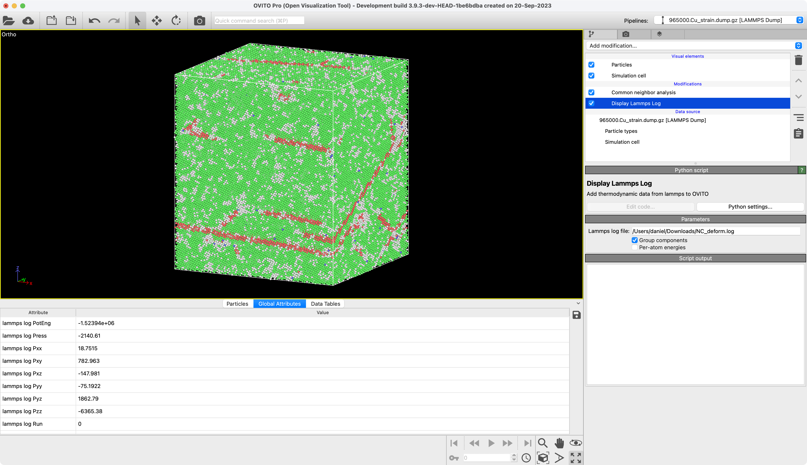

# Display Lammps Log
Display the Lammps log file alongside your structure data in OVITO Pro

## Description
This modifier takes a Lammps log file and adds it to the data inspector in OVITO Pro. The full thermodynamic output becomes available as a data table. Moreover, if thermodynamic output has been written at the timestep currently displayed in OVITO, this data will be loaded into attributes as well. Both the data table and the attributes are named as `"Lammps log {key}"`, where `key` is a [Lammps thermo keyword](https://docs.lammps.org/thermo_style.html) found in the log file.

## Parameters
- `file_name` / "Lammps log file": File system path to the Lammps log file.
- `group_components` / "Group components": Group components of a single thermodynamic keyword into a single data table in OVITO. For example, Pxx, Pyy, Pzz thermodynamic values written by Lammps are packed into a single `Lammps log P` OVITO table.
- `per_atom_energies` / "Per-atom energies": Normalize energies extracted from the Lammps log by the number of particles in the system.

## Example



## Installation
- OVITO Pro [integrated Python interpreter](https://docs.ovito.org/python/introduction/installation.html#ovito-pro-integrated-interpreter):
  ```
  ovitos -m pip install --user git+https://github.com/nnn911/DisplayLammpsLog.git
  ``` 
  The `--user` option is recommended and [installs the package in the user's site directory](https://pip.pypa.io/en/stable/user_guide/#user-installs).

- Other Python interpreters or Conda environments:
  ```
  pip install git+https://github.com/nnn911/DisplayLammpsLog.git
  ```

## Technical information / dependencies
- Tested on OVITO version 3.9.2

## Contact
Daniel Utt utt@ovito.org